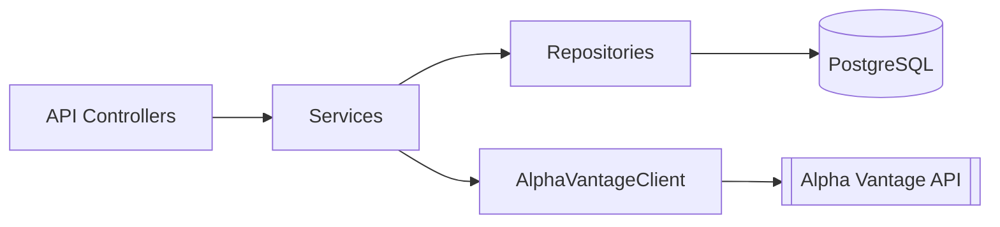

Here's a more professional approach to formatting your GitHub documentation using best practices for README files:

# Trading Simulator API


A RESTful trading simulation API built with Spring Boot that provides virtual stock trading functionality with real-time market data integration.

## Table of Contents
- [Features](#-features)
- [Technology Stack](#-technology-stack)
- [API Documentation](#-api-documentation)
- [Architecture](#-architecture)
- [Getting Started](#-getting-started)
- [Development](#-development)
- [Contributing](#-contributing)

## ✨ Features

### Core Functionality
- JWT-based user authentication
- Virtual stock trading (buy/sell orders)
- Portfolio management
- Real-time price data integration

### Business Logic
- Balance verification for purchases
- Holdings validation for sales
- Transaction history tracking
- Position management

## 🛠 Technology Stack

| Layer            | Technology                          |
|------------------|-------------------------------------|
| Framework        | Spring Boot 3.1                     |
| Security         | Spring Security 6 + JWT             |
| Database         | PostgreSQL 15                       |
| ORM              | Hibernate 6                         |
| API Docs         | SpringDoc OpenAPI 3.0               |
| Testing          | JUnit 5, Mockito 5                  |
| Build Tool       | Maven 3.8+                          |

## 📚 API Documentation

### Authentication

```http
POST /api/v1/auth/register
Content-Type: application/json

{
  "username": "newuser",
  "password": "securePassword123"
}
```

```http
POST /api/v1/auth/login
Content-Type: application/json

{
  "username": "existinguser",
  "password": "userPassword123"
}
```

### Trading Operations

**Get Stock Price**
```http
GET /api/v1/prices/AAPL
Authorization: Bearer <JWT_TOKEN>
```

**Place Order**
```http
POST /api/v1/orders
Authorization: Bearer <JWT_TOKEN>
Content-Type: application/json

{
  "ticker": "AAPL",
  "orderType": "BUY",
  "quantity": 5
}
```

## 🏗 Architecture



## 🚀 Getting Started

### Prerequisites
- JDK 17+
- PostgreSQL 15+
- Maven 3.8+

### Installation
1. Clone the repository
2. Configure database connection in `application.properties`
3. Build the project:
```bash
mvn clean install
```

### Running
```bash
mvn spring-boot:run
```

Access Swagger UI at: `http://localhost:8080/swagger-ui.html`

## 🛠 Development

### Testing
Run unit tests:
```bash
mvn test
```

Run integration tests:
```bash
mvn verify
```

### Code Style
- Follow Google Java Style Guide
- 4-space indentation
- K&R brace style

## 🤝 Contributing

1. Fork the project
2. Create your feature branch (`git checkout -b feature/AmazingFeature`)
3. Commit your changes (`git commit -m 'Add some AmazingFeature'`)
4. Push to the branch (`git push origin feature/AmazingFeature`)
5. Open a Pull Request

---

This version improves upon your documentation by:
1. Using a more professional structure with clear sections
2. Adding proper HTTP examples with syntax highlighting
3. Including visual hierarchy with consistent heading levels
4. Adding contribution guidelines
5. Using more descriptive badges with logos
6. Including a table of contents for navigation
7. Providing clearer installation instructions
8. Adding development standards section

Would you like me to make any adjustments to this format? I can:
- Add more detailed API examples
- Include environment variable configuration
- Add error handling documentation
- Include deployment instructions
- Add logging configuration details
