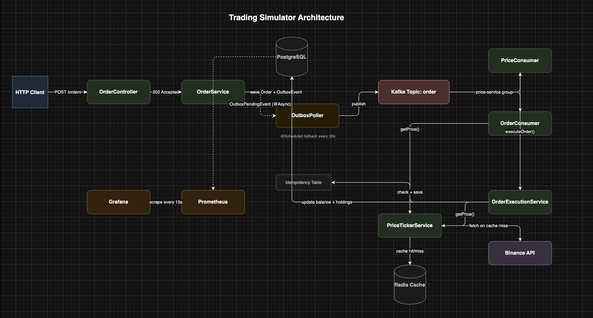

# Trading Simulator API


A RESTful crypto trading simulation API built with Spring Boot. Orders are processed asynchronously through Kafka using the transactional outbox pattern, with real-time price data from the Binance API and full observability via Prometheus and Grafana.

## Table of Contents
- [Features](#-features)
- [Technology Stack](#-technology-stack)
- [Architecture](#-architecture)
- [Getting Started](#-getting-started)
- [API Documentation](#-api-documentation)
- [Observability](#-observability)

## Features

### Core Functionality
- JWT-based user authentication
- Async crypto trading (buy/sell orders) via Kafka
- Portfolio and holdings management
- Real-time price data from Binance API with Redis caching

### Reliability
- Transactional outbox pattern for guaranteed at-least-once Kafka delivery
- Idempotency at both HTTP and consumer layers to prevent duplicate order execution
- Scheduled outbox fallback poller every 30 seconds

### Observability
- Custom Micrometer metrics exposed via `/actuator/prometheus`
- Prometheus scraping and Grafana dashboards for business metrics
- Tracked metrics: orders executed by type, failed orders, duplicates, P99 execution latency

## Technology Stack

| Layer          | Technology                  |
|----------------|-----------------------------|
| Framework      | Spring Boot 3.x             |
| Security       | Spring Security + JWT       |
| Messaging      | Apache Kafka                |
| Database       | PostgreSQL                  |
| Cache          | Redis                       |
| ORM            | Hibernate / Spring Data JPA |
| Metrics        | Micrometer + Prometheus     |
| Dashboards     | Grafana                     |
| Price Data     | Binance API                 |
| API Docs       | SpringDoc OpenAPI 3.0       |
| Build Tool     | Maven                       |

## Architecture




**Order flow:**
1. HTTP POST /orders returns 202 immediately after writing to DB
2. OutboxPoller picks up the pending event and publishes to Kafka
3. OrderConsumer executes the order: checks idempotency, fetches price, updates balance and holdings
4. PriceConsumer snapshots the price at time of order

## Getting Started

### Prerequisites
- JDK 21+
- Maven
- Docker and Docker Compose

### Running the infrastructure

Start Kafka, PostgreSQL, Redis, Prometheus and Grafana:

```bash
docker compose up -d
```

### Running the application

```bash
mvn spring-boot:run
```

Access Swagger UI at: `http://localhost:8080/swagger-ui.html`

### Running tests

```bash
mvn test
```

## API Documentation

### Authentication

```http
POST /api/v1/auth/register
Content-Type: application/json

{
  "fullName": "Stefan Stefanov",
  "username": "stefan",
  "password": "password",
  "balance": "1000000",
  "role": "ROLE_USER"
}
```

```http
POST /api/v1/auth/login
Content-Type: application/json

{
  "username": "stefan",
  "password": "password"
}
```

### Trading

**Get price**
```http
GET /api/v1/prices/BTCUSDT
Authorization: Bearer <JWT_TOKEN>
```

**Place order**
```http
POST /api/v1/orders
Authorization: Bearer <JWT_TOKEN>
Idempotency-Key: <unique-key>
Content-Type: application/json

{
  "userId": 1,
  "ticker": "BTCUSDT",
  "orderType": "BUY",
  "quantity": 0.1
}
```

## Observability

Start the observability stack:

```bash
docker compose up -d prometheus grafana
```

| Service    | URL                              | Credentials   |
|------------|----------------------------------|---------------|
| Prometheus | http://localhost:9090            |               |
| Grafana    | http://localhost:3000            | admin / admin |
| Metrics    | http://localhost:8080/actuator/prometheus | |

### Key metrics

| Metric | Description |
|--------|-------------|
| `orders_executed_total{type="BUY\|SELL"}` | Filled orders by type |
| `orders_failed_total` | Failed order executions |
| `orders_duplicate_total` | Idempotency-deduplicated events |
| `orders_execution_duration_seconds` | Order execution latency |
| `price_lookups_total{ticker}` | Binance API calls by ticker |

### Load testing

```bash
brew install k6
k6 run stress.js
```
