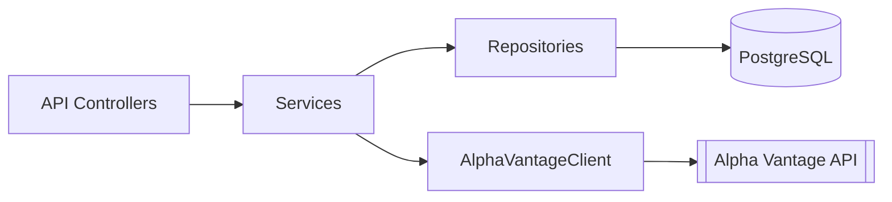

# Trading Simulator API


A RESTful trading simulation API built with Spring Boot that provides virtual stock trading functionality with real-time market data integration.

## Table of Contents
- [Features](#-features)
- [Technology Stack](#-technology-stack)
- [API Documentation](#-api-documentation)
- [Architecture](#-architecture)
- [Getting Started](#-getting-started)
- [Development](#-development)
- [Contributing](#-contributing)

## ✨ Features

### Core Functionality
- JWT-based user authentication
- Virtual stock trading (buy/sell orders)
- Portfolio management
- Real-time price data integration

### Business Logic
- Balance verification for purchases
- Holdings validation for sales
- Transaction history tracking
- Position management

## 🛠 Technology Stack

| Layer      | Technology             |
|------------|------------------------|
| Framework  | Spring Boot 4.0        |
| Security   | Spring Security  + JWT |
| Database   | PostgreSQL 16          |
| ORM        | Hibernate              |
| API Docs   | SpringDoc OpenAPI 3.0  |
| Testing    | JUnit, Mockito         |
| Build Tool | Maven                  |

## 📚 API Documentation

### Authentication

```http
POST /api/v1/auth/register
Content-Type: application/json

{
  "fullName": "fullName",
  "username": "newuser",
  "password": "securePassword123"
  "balance" : "1000000",
  "role" : "ROLE_USER"
}
```

```http
POST /api/v1/auth/login
Content-Type: application/json

{
  "username": "existinguser",
  "password": "userPassword123",
}
```

### Trading Operations

**Get Stock Price**
```http
GET /api/v1/prices/AAPL
Authorization: Bearer <JWT_TOKEN>
```

**Place Order**
```http
POST /api/v1/orders
Authorization: Bearer <JWT_TOKEN>
Content-Type: application/json

{
  "userId" : "userId",
  "ticker": "AAPL",
  "orderType": "BUY",
  "quantity": 5
}
```

## 🏗 Architecture


```mermaid
graph LR
    A[API Controllers] --> B[Services]
    B --> C[Repositories]
    C --> D[(PostgreSQL)]
    B --> E[AlphaVantageClient]
    E --> F[[Alpha Vantage API]]
```

## 🚀 Getting Started

### Prerequisites
- JDK 21+
- PostgreSQL 16+
- Maven 

### Installation
1. Clone the repository
2. Configure database connection in `application.properties`
3. Build the project:
```bash
mvn clean install
```

### Running
```bash
mvn spring-boot:run
```

Access Swagger UI at: `http://localhost:8080/swagger-ui.html`

## 🛠 Development

### Testing
Run unit tests:
```bash
mvn test
```

Run integration tests:
```bash
mvn verify
```

### Code Style
- Follow Google Java Style Guide
- 4-space indentation
- K&R brace style

## 🤝 Contributing

1. Fork the project
2. Create your feature branch (`git checkout -b feature/AmazingFeature`)
3. Commit your changes (`git commit -m 'Add some AmazingFeature'`)
4. Push to the branch (`git push origin feature/AmazingFeature`)
5. Open a Pull Request

---
